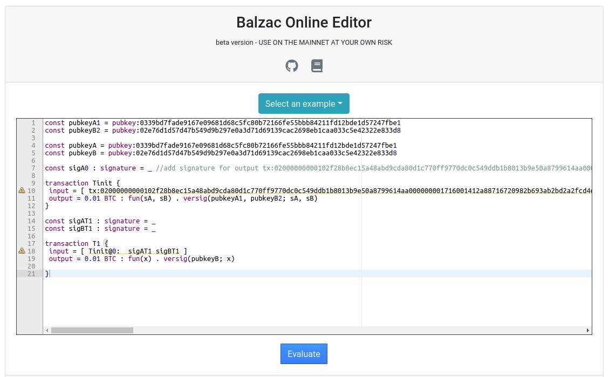
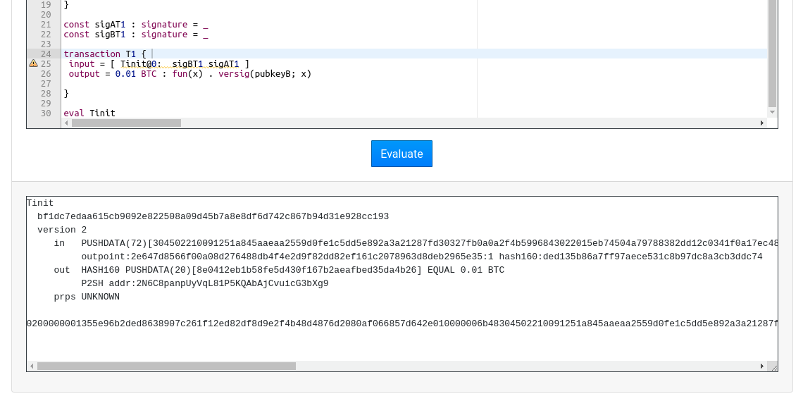

==============================
Compiling |langname| contracts
==============================

|langname| is implemented as Racket language. You can use it either through DrRacket 
or through the racket command-line interpreter. In this tutorial we will use DrRacket.

""""""""""""""""""""""""""""""""""
From BitML to Balzac transactions
""""""""""""""""""""""""""""""""""

We start compiling the following contract:

.. code-block:: bitml

	#lang bitml

	(participant "A" "0339bd7fade9167e09681d68c5fc80b72166fe55bbb84211fd12bde1d57247fbe1")
	(participant "B" "034a7192e922118173906555a39f28fa1e0b65657fc7f403094da4f85701a5f809")

	(debug-mode)

	(define (txA) "tx:02000000000101000225925157edb93dda00c3765d5f6aee486b67737662cf46cb436471c645f918000000171600145093f95239942f953d077e72c495583ed601cc95feffffff0240420f00000000001976a914ded135b86a7ff97aece531c8b97dc8a3cb3ddc7488ac75d513000000000017a91451329a63924dcc4876c6e94c6ad4957cedd115b88702463043022040fc9549ec6b98027dd7f73373317b05dabb2c528f081a00b4e25ed34ca6e91f021f319d47780bb90a61b4e5257f47ccbb52eee736f4897d5b4d5a19b3df5f3ed8012102df8bd0680cb7ecf1f70eef399f9359a025b96fb776055a2150cbc973def82c116d191700@0")
	(define (txFee) "tx:02000000000101adbcf28818d2556fb85ce7f6068775a6a4fd4befe650d3d7d120b609e5af1e920100000017160014a5d12120913a41cdd3be9ef88b60838b8c0db3b7feffffff028ac710000000000017a914664180e7578033f9cef5bc82b3112855f775f02587a0860100000000001976a914ded135b86a7ff97aece531c8b97dc8a3cb3ddc7488ac024730440220290f9526ed5e22d4ae72c66702f5f70dff4c5ea72445cd20112782da1986332e02201d872a0a53fa13b34a9273776dfcd0ea7385e449fec1e95263bdde96fda084e10121021215eb7fabd9bb0c1f1441bf35bade28d9e64dc798a666eb4eaf47e134a74b446d191700@1")

	(contract
	 (pre (deposit "A" 0.01 (ref (txA)))
	      (fee "A" 0.001 (ref (txFee))))

	 (withdraw "B"))

The contract is a simple transfer of currency: the BTC deposited in the contract are transferred to :bitml:`"B"`.
The preconditions of the contract require :bitml:`"A"` to provide two transaction outputs:

*	:bitml:`(deposit "A" 0.01 (ref (txA))` of value 0.01 BTC, to be used as a deposit,
*	:bitml:`(fee "A" 0.001 (ref (txFee)))` of value 0.001 BTC, to be used to provide a fee for each transaction.
	If the value of this deposit is greater than the fee required to execute the contract, 
	the change will be redeemed by the participant who redeems the last transaction of the contract.

The transaction output :bitml:`txA` is redeemable by :bitml:`"A"` through her private key. 
The value :bitml:`"tx:02000000000102f28b8e...0512e2be394297475ed157a9cfc6bdb51600"` is the serialized transaction, 
which can be obtained through the Bitcoin command line
or a `block explorer <https://chain.so/tx/BTCTEST/6aa0154ee6f0981e2e447d569db2a7d2a1534cf3c535031cd76564cf01fae57b/>`_.
The same holds for transaction output :bitml:`txFee`.

Paste the code into a DrRacket window, then hit the "Run" button in the upper right corner.

.. Hint::
	Don't forget to specify you are using |langname| by starting your file with :bitml:`#lang bitml`. 

.. figure:: _static/img/compiled.png
	:scale: 90 %
	:class: img-border
	:align: center

DrRacket will show the output of the compilation, which contains the transactions of the contract,
expressed in `Balzac <https://blockchain.unica.it/balzac/docs/>`_.

"""""""""""""""""""""""""""""""
From Balzac to Bitcoin
"""""""""""""""""""""""""""""""

Balzac is an high-level language for writing transactions, verifying their correctness, and compiling them into actual Bitcoin transactions.
We exploit Balzac to compile the transaction of the contract, so we can send them to the Bitcoin network.

Here is the compiled output of the previous contract. 

.. code-block:: balzac

	const pubkeyA2 = pubkey:0339bd7fade9167e09681d68c5fc80b72166fe55bbb84211fd12bde1d57247fbe1
	const pubkeyB1 = pubkey:034a7192e922118173906555a39f28fa1e0b65657fc7f403094da4f85701a5f809

	const pubkeyB = pubkey:034a7192e922118173906555a39f28fa1e0b65657fc7f403094da4f85701a5f809
	const pubkeyA = pubkey:0339bd7fade9167e09681d68c5fc80b72166fe55bbb84211fd12bde1d57247fbe1

	const sigA0 : signature = _ //add signature for output tx:02000000000101000225925157edb93dda00c3765d5f6aee486b67737662cf46cb436471c645f918000000171600145093f95239942f953d077e72c495583ed601cc95feffffff0240420f00000000001976a914ded135b86a7ff97aece531c8b97dc8a3cb3ddc7488ac75d513000000000017a91451329a63924dcc4876c6e94c6ad4957cedd115b88702463043022040fc9549ec6b98027dd7f73373317b05dabb2c528f081a00b4e25ed34ca6e91f021f319d47780bb90a61b4e5257f47ccbb52eee736f4897d5b4d5a19b3df5f3ed8012102df8bd0680cb7ecf1f70eef399f9359a025b96fb776055a2150cbc973def82c116d191700@0
	const sigAFee : signature = _ //add signature for output tx:02000000000101adbcf28818d2556fb85ce7f6068775a6a4fd4befe650d3d7d120b609e5af1e920100000017160014a5d12120913a41cdd3be9ef88b60838b8c0db3b7feffffff028ac710000000000017a914664180e7578033f9cef5bc82b3112855f775f02587a0860100000000001976a914ded135b86a7ff97aece531c8b97dc8a3cb3ddc7488ac024730440220290f9526ed5e22d4ae72c66702f5f70dff4c5ea72445cd20112782da1986332e02201d872a0a53fa13b34a9273776dfcd0ea7385e449fec1e95263bdde96fda084e10121021215eb7fabd9bb0c1f1441bf35bade28d9e64dc798a666eb4eaf47e134a74b446d191700@1

	const privkeyA = key:cUnBMKCcvtpuVcfWajJBEF9uQaeNJmcRM6Vasw1vj3ZkiaoAGEuH

	transaction Tinit { 
	 input = [ tx:02000000000101000225925157edb93dda00c3765d5f6aee486b67737662cf46cb436471c645f918000000171600145093f95239942f953d077e72c495583ed601cc95feffffff0240420f00000000001976a914ded135b86a7ff97aece531c8b97dc8a3cb3ddc7488ac75d513000000000017a91451329a63924dcc4876c6e94c6ad4957cedd115b88702463043022040fc9549ec6b98027dd7f73373317b05dabb2c528f081a00b4e25ed34ca6e91f021f319d47780bb90a61b4e5257f47ccbb52eee736f4897d5b4d5a19b3df5f3ed8012102df8bd0680cb7ecf1f70eef399f9359a025b96fb776055a2150cbc973def82c116d191700@0:sigA0; tx:02000000000101adbcf28818d2556fb85ce7f6068775a6a4fd4befe650d3d7d120b609e5af1e920100000017160014a5d12120913a41cdd3be9ef88b60838b8c0db3b7feffffff028ac710000000000017a914664180e7578033f9cef5bc82b3112855f775f02587a0860100000000001976a914ded135b86a7ff97aece531c8b97dc8a3cb3ddc7488ac024730440220290f9526ed5e22d4ae72c66702f5f70dff4c5ea72445cd20112782da1986332e02201d872a0a53fa13b34a9273776dfcd0ea7385e449fec1e95263bdde96fda084e10121021215eb7fabd9bb0c1f1441bf35bade28d9e64dc798a666eb4eaf47e134a74b446d191700@1:sigAFee ] 
	 output = 0.010700000000000001 BTC : fun(sB, sA) . 
	 (( versig(pubkeyB1, pubkeyA2; sB, sA) )) 
	}

	const sigBT1 : signature = _ 
	const sigAT1 : signature = _ 

	transaction T1 { 
	 input = [ Tinit@0:  sigBT1 sigAT1 ] 
	 output = 0.0104 BTC : fun(x) . versig(pubkeyB; x) 
	 
	}

Start by pasting it in the `Balzac web editor <https://editor.balzac-lang.xyz/>`_.

To stipulate the contract :bitml:`"A"` have to sign the transaction :balzac:`Tinit` and send it to the Bitcoin network.
Balzac can compute the signature for her, but it needs her public key. So, she adds it:

.. code-block:: balzac
	
	const privkeyA = key:cUnBMKCcvtpuVcfWajJBEF9uQaeNJmcRM6Vasw1vj3ZkiaoAGEuH

Now, she can compute and add the signature to the transaction :balzac:`Tinit`,
with the :balzac:`sig(_)` function.

.. code-block:: balzac

	transaction Tinit { 
	 input = [ tx:02000000000101000225925157edb93dda00c3765d5f6aee486b67737662cf46cb436471c645f918000000171600145093f95239942f953d077e72c495583ed601cc95feffffff0240420f00000000001976a914ded135b86a7ff97aece531c8b97dc8a3cb3ddc7488ac75d513000000000017a91451329a63924dcc4876c6e94c6ad4957cedd115b88702463043022040fc9549ec6b98027dd7f73373317b05dabb2c528f081a00b4e25ed34ca6e91f021f319d47780bb90a61b4e5257f47ccbb52eee736f4897d5b4d5a19b3df5f3ed8012102df8bd0680cb7ecf1f70eef399f9359a025b96fb776055a2150cb
	 c973def82c116d191700@0:sig(privkeyA); 
	 tx:02000000000101adbcf28818d2556fb85ce7f6068775a6a4fd4befe650d3d7d120b609e5af1e920100000017160014a5d12120913a41cdd3be9ef88b60838b8c0db3b7feffffff028ac710000000000017a914664180e7578033f9cef5bc82b3112855f775f02587a0860100000000001976a914ded135b86a7ff97aece531c8b97dc8a3cb3ddc7488ac024730440220290f9526ed5e22d4ae72c66702f5f70dff4c5ea72445cd20112782da1986332e02201d872a0a53fa13b34a9273776dfcd0ea7385e449fec1e95263bdde96fda084e10121021215eb7fabd9bb0c1f1441bf35bade28d9e64dc798a666eb4eaf47e134a7
	 4b446d191700@1:sig(privkeyA) ] 
	 output = 0.01070000000000000 BTC : fun(sB, sA) . 
	 (( versig(pubkeyB1, pubkeyA2; sB, sA) )) 
	}

Firstly, :bitml:`"A"` evaluates the transaction :balzac:`Tinit` adding to the bottom of the file:

.. code-block:: balzac

	eval Tinit

then pressing the button "Evaluate".

The last string in the picture above is the serialized transaction that can be published in the Bitcoin network as
described `here <https://blockchain.unica.it/balzac/docs/raw-transactions.html>`_.
You can find the transaction on a Bitcoin Testnet `explorer <https://chain.so/tx/BTCTEST/155f58c8c8b4c98d6de1e61a96463b04b3c3aceb6459c9fec5c140d4f6e7eba6>`_.

.. Warning::
	In this tutorial we work on the Bitcoin testnet. If you want to use the mainnet (at your own risk), add :balzac:`network mainnet` to your Balzac file.